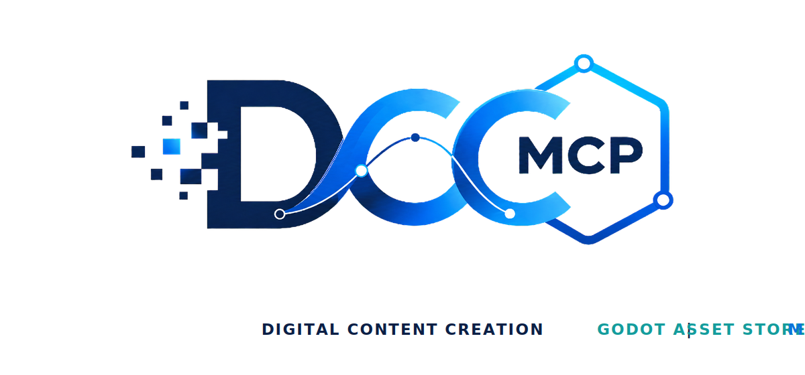
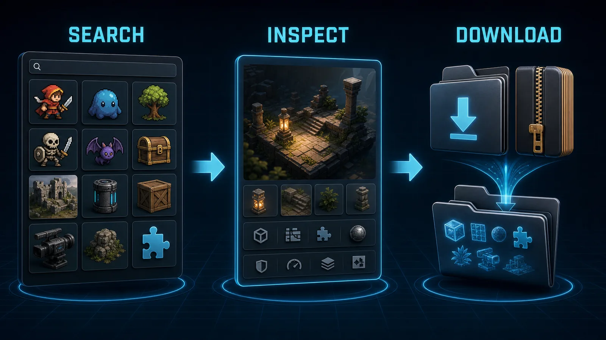

# DCC-MCP Godot Asset Store

<p align="center">
  
</p>

## Agent workflow

AI agents should use installed package skills through the shared gateway. IDE
users may continue to use the MCP endpoint.

```bash
dcc-mcp-cli dcc-types
dcc-mcp-cli list
dcc-mcp-cli search --query "<task>" --dcc-type <host>
dcc-mcp-cli describe <tool-slug>
dcc-mcp-cli call <tool-slug> --json '{"key":"value"}'
```

If the package skill is not active, call
`dcc-mcp-cli load-skill <skill-name> --dcc-type <host>`. After the task,
query `dcc-mcp-cli stats --range 24h --session-id <task-id>` and pass only
bounded evidence to the `review_skill_improvement` prompt from
`dcc-mcp-skills-creator`.




Discover and download reusable packages from the
[Godot Asset Store](https://store.godotengine.org/) without coupling remote
catalog logic to the Godot adapter.

The provider returns a `godot_asset_package` containing the archive path,
SHA-256 digest, package type, version compatibility, license, and source URLs.
The bundled `godot-assets` host skill plans and installs that package into a
Godot project.

## Install

```bash
dcc-mcp-cli marketplace add dcc-mcp/dcc-asset-godot-store
dcc-mcp-cli marketplace install dcc-asset-godot-store
```

## Tools

- `search_godot_assets`
- `inspect_godot_asset`
- `download_godot_asset`

`download_godot_asset` supports free packages and requires explicit acceptance
of the [Godot Asset Store terms](https://store.godotengine.org/terms/).
